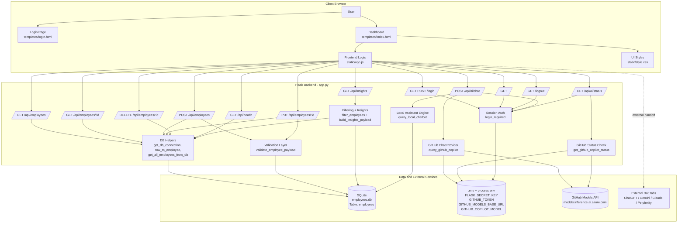
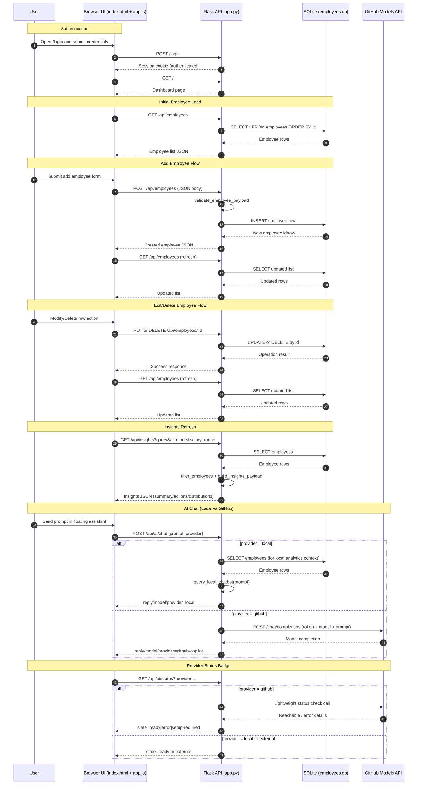

# Medivra Employee Desk

## 1. Project Overview

Medivra Employee Desk is a Flask-based employee management application with:

- REST APIs for CRUD operations on employees
- Login-protected web UI for daily operations
- AI assistant experiences:
  - Local in-app assistant for workforce analytics and helper responses
  - GitHub Copilot API mode for in-app model responses
  - External handoff options (ChatGPT, Gemini, Claude, Perplexity)

The project uses SQLite for persistence and a modern JavaScript frontend for interactive filtering, sorting, pagination, charts, and floating AI chat.

---

## 2. Tech Stack

- Backend: Python, Flask
- Database: SQLite (`employees.db`)
- Frontend: HTML, CSS, vanilla JavaScript, Chart.js
- Environment config: `python-dotenv`
- AI provider integration:
  - Local rule-based assistant
  - GitHub Models endpoint (GitHub Copilot mode)

---

## 3. Project Structure

- `app.py`
  - Flask application, routes, validation, database setup, AI integration
- `templates/index.html`
  - Main authenticated web application UI
- `templates/login.html`
  - Login screen
- `static/app.js`
  - All frontend logic (table, forms, AI flows, floating assistant)
- `static/style.css`
  - UI styling for app, login, AI panel, and floating assistant
- `.env`
  - Runtime secrets and environment settings
- `requirements.txt`
  - Python dependencies
- `test_api.py`
  - Scripted API tests

---

## 4. Prerequisites

- Python 3.7+
- pip
- Internet access (required for GitHub Copilot API mode)

Optional but recommended:

- Virtual environment (`venv`)

---

## 5. Environment Configuration

Create and configure `.env` in the project root.

Required:

```env
FLASK_SECRET_KEY=your_secret_key
```

For in-app GitHub Copilot mode:

```env
GITHUB_TOKEN=your_token_here
GITHUB_MODELS_BASE_URL=https://models.inference.ai.azure.com
GITHUB_COPILOT_MODEL=gpt-4o-mini
```

Optional login override:

```env
MEDIVRA_APP_USERNAME=admin
MEDIVRA_APP_PASSWORD=medivra123
```

Notes:

- The application loads `.env` with override behavior, so `.env` values take precedence over inherited process env variables.
- Keep tokens private. Never commit `.env`.

---

## 6. Installation Steps

From project root:

```bash
python -m venv venv
```

Windows activation:

```bash
venv\Scripts\activate
```

Install dependencies:

```bash
pip install -r requirements.txt
```

---

## 7. Run the Project (Execution Steps)

Start server:

```bash
python app.py
```

Open browser:

- Login page: `http://127.0.0.1:5000/login`
- App page after login: `http://127.0.0.1:5000/`

Default login (if env vars not overridden):

- Username: `admin`
- Password: `medivra123`

---

## 8. Runtime Execution Flow

### 8.1 Backend startup

1. Load `.env`
2. Initialize Flask app and secret key
3. Create SQLite DB/table if missing
4. Seed sample employee data if table is empty
5. Register HTTP routes and start server

### 8.2 Authentication flow

1. User submits credentials on `/login`
2. On success, session flag `is_authenticated` is set
3. Protected pages and AI routes require session auth

### 8.3 Employee management flow

1. Frontend fetches `/api/employees`
2. Renders table with sorting/filtering/pagination in browser
3. Create/update/delete actions call corresponding API routes
4. UI refreshes data and insights after each operation

### 8.4 AI assistant flow

- Local provider:
  - Frontend sends prompt to `/api/ai/chat` with `provider=local`
  - Backend runs local assistant logic and returns response

- GitHub provider:
  - Frontend sends prompt with `provider=github`
  - Backend calls GitHub Models endpoint and returns model output

- Provider status:
  - Frontend calls `/api/ai/status?provider=<name>`
  - Badge shows `Ready`, `External`, `Setup Required`, or `Error`

---

## 9. API Summary

### Health

- `GET /api/health`

### Employee APIs

- `GET /api/employees`
- `GET /api/employees/<emp_id>`
- `POST /api/employees`
- `PUT /api/employees/<emp_id>`
- `DELETE /api/employees/<emp_id>`

### Insights

- `GET /api/insights`
  - Supports query params for text and salary filter modes

### AI APIs (login required)

- `POST /api/ai/chat`
  - Body: `prompt`, optional `provider`
- `GET /api/ai/status?provider=local|github|...`

---

## 9A. Detailed API-to-Data Mapping

This section explains, for each API, what data it reads/writes, where that data comes from, and which frontend feature uses it.

### 9A.1 Core Data Model

Primary table: `employees` (SQLite, file: `employees.db`)

Columns:

- `id` (INTEGER, PK, AUTOINCREMENT)
- `name` (TEXT, required)
- `email` (TEXT, required, unique)
- `salary` (INTEGER, required)
- `department` (TEXT, required)
- `manager` (TEXT, required)
- `geo_location` (TEXT, required)

In-memory derived data:

- Filtered employee list from `filter_employees(...)`
- Insights payload from `build_insights_payload(...)`
- AI status object from `get_github_copilot_status()` or static local/external status objects

---

### 9A.2 Route-by-Route Mapping

#### A. `GET /api/health`

- Source of data:
  - Executes `SELECT 1` against SQLite to verify connectivity.
  - No table scan.
- Writes data:
  - None.
- Response data:
  - `status`, `message`, `database`, `timestamp`.
- Frontend consumer:
  - Not used by `static/app.js`; used for diagnostics/ops.

#### B. `GET /api/employees`

- Source of data:
  - Reads all rows from `employees` ordered by `id ASC` through `get_all_employees_from_db()`.
- Writes data:
  - None.
- Response data:
  - `count`, `data[]` where each item has employee fields.
- Frontend consumer:
  - `loadEmployees()` in `static/app.js`.
  - Drives employee table, filters, pagination, and fallback insight rendering.

#### C. `GET /api/employees/<emp_id>`

- Source of data:
  - Reads one row by `id` via `get_employee_by_id(emp_id)`.
- Writes data:
  - None.
- Response data:
  - Success: one employee object.
  - Not found: error message.
- Frontend consumer:
  - Search form lookup.
  - Edit flow prefill.
  - View modal fetch.

#### D. `POST /api/employees`

- Source of data:
  - Request JSON body from UI add form.
- Validation rules:
  - Required fields check.
  - Email regex check.
  - Salary integer and range bounds.
  - Email uniqueness check in DB.
- Writes data:
  - Inserts one row into `employees`.
- Response data:
  - Newly created employee record.
- Frontend consumer:
  - Add Employee form submit handler.

#### E. `PUT /api/employees/<emp_id>`

- Source of data:
  - Existing employee row + partial request JSON body.
- Validation rules:
  - At least one updatable field required.
  - Same field-level checks as create.
  - Duplicate email prevention excluding current employee.
- Writes data:
  - Updates only provided fields for one row.
- Response data:
  - Updated employee record.
- Frontend consumer:
  - Modify flow save action.

#### F. `DELETE /api/employees/<emp_id>`

- Source of data:
  - Existing employee row by `id`.
- Writes data:
  - Deletes one row from `employees`.
- Response data:
  - Deleted employee object returned for UI feedback.
- Frontend consumer:
  - Delete action in table row.

#### G. `GET /api/insights`

- Source of data:
  - Reads all employees.
  - Applies query + AI mode + salary range filter in backend.
  - Builds summary/action/distribution payload.
- Query params:
  - `query`
  - `ai_mode` (`all`, `high-salary`, `salary-range`)
  - `min_salary`, `max_salary`
- Writes data:
  - None.
- Response data:
  - `visible_count`, `department_count`, `average_salary`, `top_manager`,
  - `summary`, `actions[]`, `distributions`.
- Frontend consumer:
  - `refreshInsights()` in `static/app.js`.
  - Updates top cards, summary text, suggested actions list, and both charts.

#### H. `POST /api/ai/chat` (login required)

- Source of data:
  - Request JSON body with `prompt` and optional `provider`.
  - Provider routing:
    - `local`: calls `query_local_chatbot(prompt)` (rule-based response from workforce data + keyword logic).
    - `github`: calls `query_github_copilot(prompt)` (remote inference API).
- Writes data:
  - None persisted in DB.
- Response data:
  - `reply`, `model`, `provider`.
- Frontend consumer:
  - Floating assistant submit flow for local/github in-app responses.
  - Main AI panel chat mode also uses this endpoint.

#### I. `GET /api/ai/status` (login required)

- Source of data:
  - Query param `provider`.
  - For `github`: live connectivity check to configured GitHub Models endpoint.
  - For `local`: static ready object.
  - For external providers: static external object.
- Writes data:
  - None.
- Response data:
  - `provider`, `state`, `label`, `message`.
- Frontend consumer:
  - Floating assistant status badge rendering.

---

### 9A.3 Frontend-to-API Usage Matrix

- Employee list/table bootstrap:
  - UI: page load
  - API: `GET /api/employees`
  - Data consumed: full employee array

- Employee search by ID:
  - UI: Search form
  - API: `GET /api/employees/<id>`
  - Data consumed: single employee

- Add employee:
  - UI: Add form submit
  - API: `POST /api/employees`
  - Data written: one employee row
  - Data consumed: created employee

- Edit employee:
  - UI: Modify action + Save
  - APIs:
    - `GET /api/employees/<id>` to prefill
    - `PUT /api/employees/<id>` to persist
  - Data written: updated fields on one employee row

- Delete employee:
  - UI: Delete action
  - API: `DELETE /api/employees/<id>`
  - Data written: row deletion

- Insights/cards/charts:
  - UI: filter/sort/AI mode updates
  - API: `GET /api/insights`
  - Data consumed: summary + distributions

- Floating assistant chat (in-app providers):
  - UI: assistant send
  - API: `POST /api/ai/chat`
  - Data consumed: reply/model/provider

- Floating assistant status badge:
  - UI: on widget load/provider switch
  - API: `GET /api/ai/status?provider=...`
  - Data consumed: state/label/message

---

### 9A.4 External Integrations and Data Boundaries

- GitHub provider (`provider=github`):
  - Sends prompt text to GitHub Models API.
  - Returns model-generated text to UI.
  - No AI chat transcripts are stored in SQLite.

- External handoff providers (ChatGPT/Gemini/Claude/Perplexity):
  - Frontend opens external URL.
  - Prompt may be copied to clipboard or attached via query params (provider-dependent).
  - No request is sent to backend for these external-open actions.

---

## 10. Implementation Highlights

### 10.1 Backend (`app.py`)

- Data validation includes:
  - Required fields
  - Email format checks
  - Salary bounds checks
  - Email uniqueness checks
- Database helper functions centralize row conversion and connections
- AI provider handlers:
  - `query_local_chatbot(prompt)` for deterministic local responses
  - `query_github_copilot(prompt)` for GitHub model inference
  - `get_github_copilot_status()` for badge health checks

### 10.2 Frontend (`static/app.js`)

- Employee table features:
  - Client-side filtering
  - Sort by multiple fields
  - Pagination controls
- Dashboard features:
  - Summary cards
  - Insights panel
  - Chart.js visualizations
- Floating assistant:
  - Draggable and minimizable panel
  - Provider selector
  - In-app request path for local/github
  - External open-in-tab path for other bots
  - Real-time provider status badge

### 10.3 Styling (`static/style.css`)

- Responsive layout for desktop/mobile
- Distinct visual sections for login, dashboard, AI panel, floating widget
- Status badge styles for provider states

---

## 11. Testing Guide

### 11.1 Quick manual checks

1. Login works
2. Employee table loads
3. Create employee
4. Edit employee
5. Delete employee
6. AI local prompt returns expected helper response
7. AI GitHub prompt returns model response
8. Status badge changes by provider

### 11.2 Script-based API checks

Run:

```bash
python test_api.py
```

This validates health and core employee CRUD workflows.

---

## 12. Troubleshooting

### AI GitHub returns unauthorized

Possible causes:

- Invalid token
- Missing Models permission
- Wrong endpoint configuration

Actions:

1. Regenerate token with Models access
2. Update `.env`
3. Restart server
4. Recheck `/api/ai/status?provider=github`

### Prompt is required

- Request body is missing or malformed JSON
- Ensure `Content-Type: application/json`

### Redirect to `/login` from AI APIs

- Session not authenticated
- Login first in browser before AI calls

### Data not persisting

- Verify write permission in project directory for `employees.db`

---

## 13. Security Guidelines

- Never commit `.env` or raw tokens
- Rotate credentials immediately if exposed
- Use strong `FLASK_SECRET_KEY`
- For production, run behind a production WSGI server and secure transport

---

## 14. Development Guidelines

- Keep backend validation authoritative
- Keep frontend optimistic but error-aware
- Preserve route response shape consistency (`status`, `message/data`, `timestamp`)
- Prefer small, testable helper functions for new features
- Update docs when adding new routes or provider behavior

---

## 15. Suggested Next Enhancements

- Auto fallback from GitHub provider to local provider on transient failures
- Persist floating assistant chat history in local storage
- Add role-based access controls and audit logs
- Add automated unit/integration tests for AI endpoints

---

## 16. One-Page Architecture Diagram

The following diagram summarizes end-to-end request flow, API boundaries, and data ownership.



### Diagram Notes

1. Source of truth for employee data is only SQLite (`employees.db`).
2. Local assistant responses are computed in backend logic and are not persisted.
3. GitHub Copilot mode uses server-side environment credentials and calls GitHub Models API.
4. Status badge reads `/api/ai/status` and does not modify employee data.
5. External bot providers are launched from frontend and bypass backend chat processing.

---

## 17. API Sequence Diagram

The sequence below shows the most common user journey: login, employee operations, insights refresh, and AI assistant interaction.



### Sequence Notes

1. Employee data persistence occurs only in SQLite through CRUD routes.
2. Local AI mode reads employee data but does not write chat history to DB.
3. GitHub AI mode sends only prompt/model payload to GitHub Models endpoint.
4. Insights are computed on demand from current DB state and active filters.
5. Session authentication is required for AI endpoints (`/api/ai/chat`, `/api/ai/status`).
